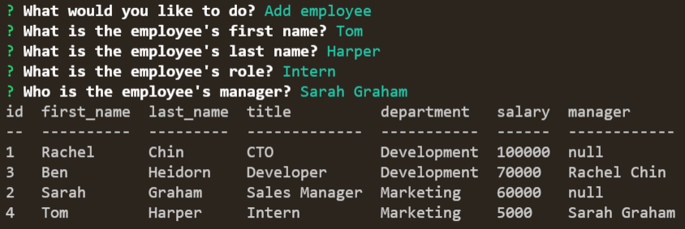

# Team Profile Generator

## Description 
This app is a command line content management system that allows business owners to view and manage the departments, roles, and employees in their company.

## Table of Contents

1. [Installation](#installation)
2. [Usage](#usage)
3. [License](#license)
4. [Contributing](#contributing)
5. [Tests](#tests)
6. [Questions](#questions)

## Installation
Install node.js, mysql, and npm. Then, clone this repo. Open the file called connection.js, which is located in the db folder. Create a .env file in the root directory with the following contents:

DB_USER='your username for mysql'
DB_PASS='your password for mysql'
DB_NAME='your database name'

You'll want to change the name of your database in the schema.sql file to match the name you choose for the .env file. Lastly, log into the mysql shell and type source schema.db. This will set up the database.

## Usage
Log into mysql in the terminal and type:

source ./db/schema.sql

This will set up the database. Then log out of mysql and type:

node index.js

This will open the application. To avoid errors, input your data in this order:

1. Add departments
2. Add roles
3. Add employees - start with managers before adding regular employees

If you need to update and employee role, choose "Update Employee Role". You can also choose to "View all Roles", "View all Departments", and "View all Employees".

A video demo is linked here: https://drive.google.com/file/d/1eZ0O-s5BxHLujaAbXrrJ2ftmdaLJjjoq/view

A screenshot from the demo is shown below:

## License
This application is covered under the MIT License.

## Contributing
This project is not actively accepting contributions at this time.

## Tests
There are no tests written for this application at this time.

## Questions
You can reach me with questions at rtc145@gmail.com or view my github page at https://github.com/Chillaroo.
    
